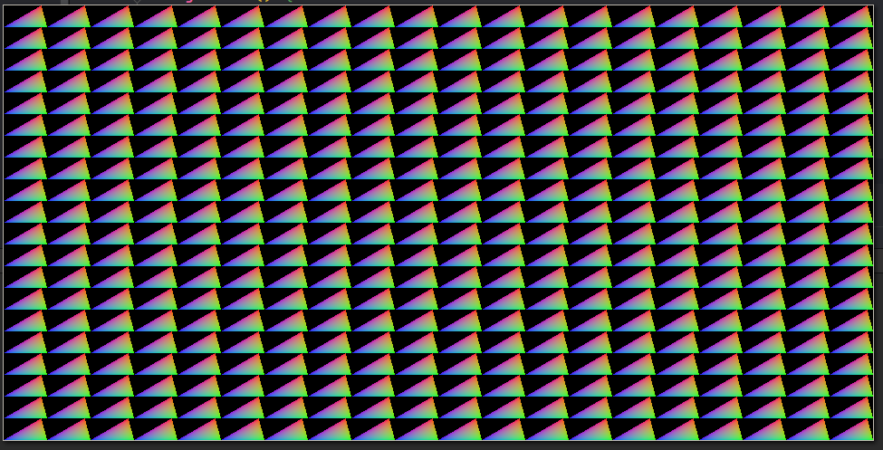

# go-glx/vgl

VGL is vulkan graphics library

__NOT READY FOR ANY REAL USAGE YET (IN DEV)__

---

Its primitive 2D-only graphics library for drawing simple staff like circles, boxes, lines, polygons and textures.

Also support custom SPIR-V shaders

This library use Vulkan for sending GPU commands.

## Usage

This library can be used in high performance and rich graphic
applications. (2D Game engines)

3D not supported right now

## Arch

```
vgl -> driver -> GPU
                  |
                  WM
```

Available drivers:
- vulkan

Available WM:
- glfw
- SDL (todo)

Available GPUs:
- any discrete/integrated/dual(optimus) GPU with shader v1+ support

## Current state of dev

Basic triangles rendering:


- [x] shaders rendering
- [x] instancing, optimizations
- [ ] buildIn shaders libs: point(+), line(+), circle, triangle(+), rect(+), polygon
- [ ] culling in local space
- [ ] move arch package to separate go module (go.mod deps split)
- [ ] blend modes
- [ ] 2d textures
- [ ] bunnies stress test
- [ ] polish
- [ ] tests
  - integrated GPU 
  - PRESENT_MODE_MAILBOX_KHR (on integrated GPU)
  - close all todos
- [ ] documentation
- [ ] release v1.0


